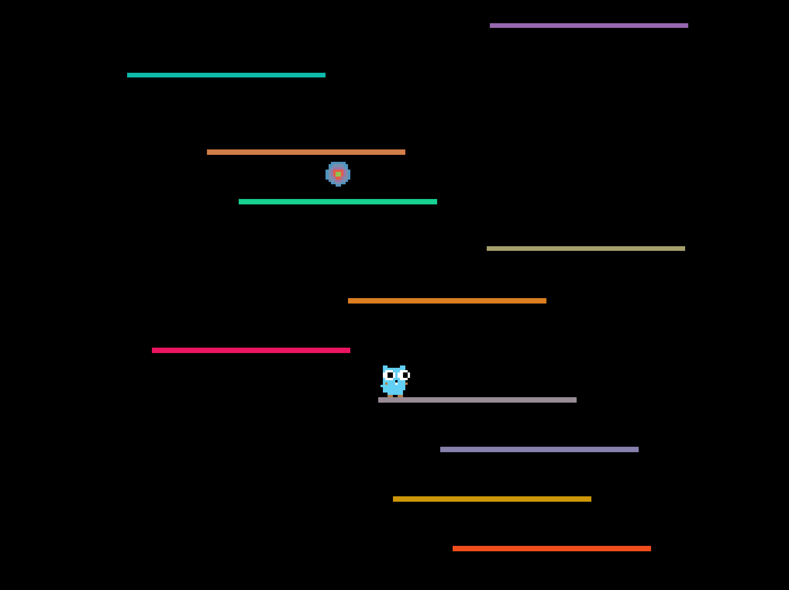

## Go Tower

Two game inspired by NS-Shaft, written in Go using the [Pixel](https://github.com/faiface/pixel).

**How to play**, navigate to its directory, then `go run` the `main.go` file. For example:

```
$ cd platformer
$ go run main.go
```

Here are some screenshots from the examples!

| [Gopher Up](GopherUp) | [Gopher Down](GopherDown) |
| --- | --- |
|  |  |
